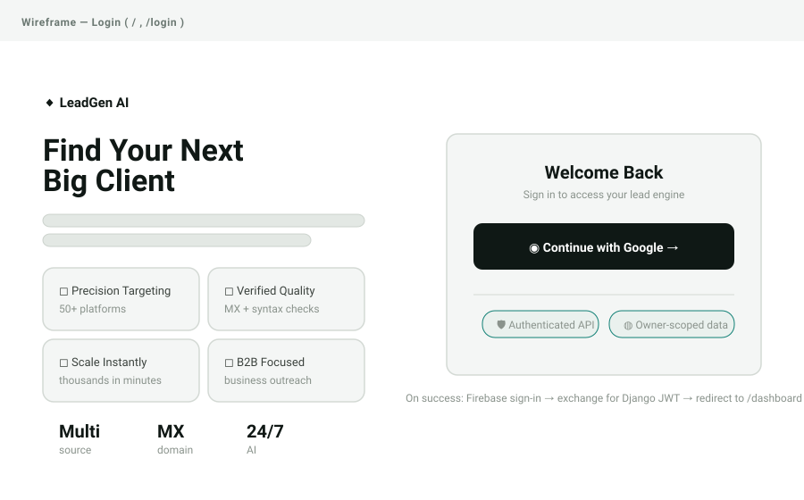
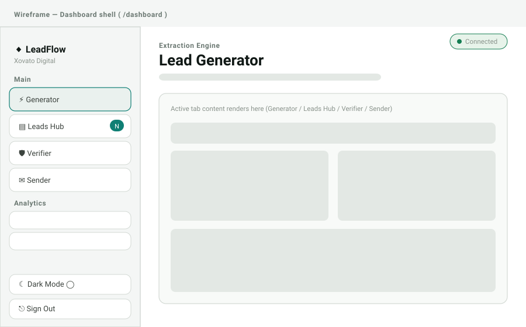
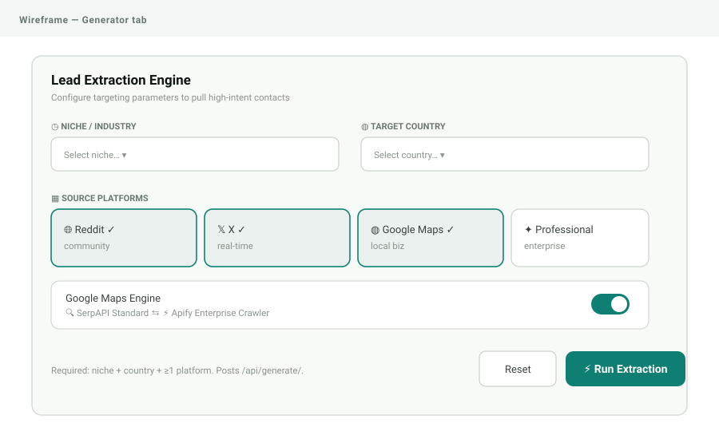
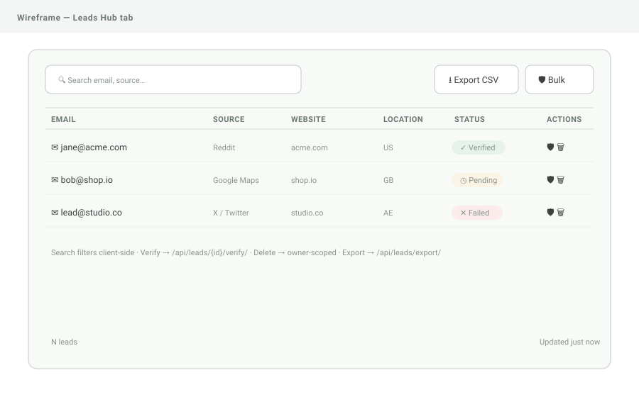
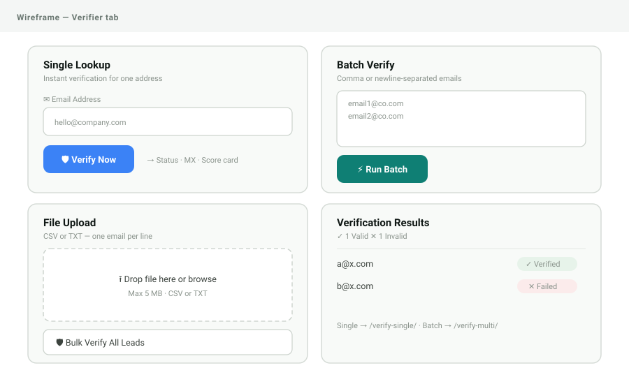
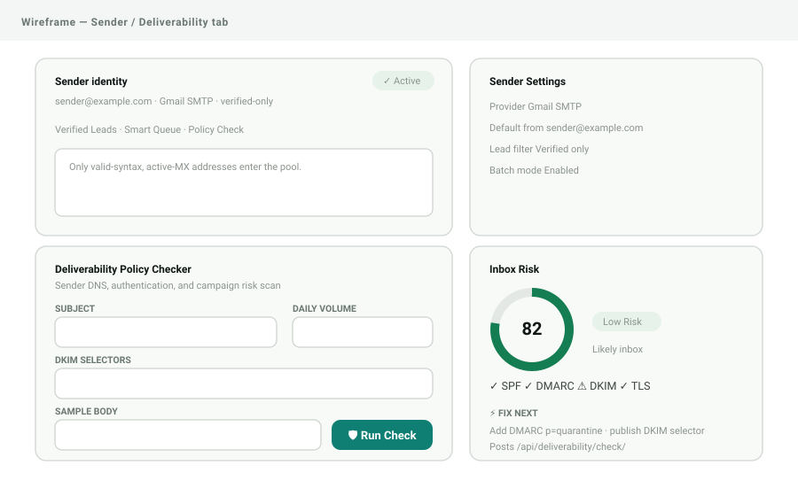

# LeadGen AI

AI-assisted **B2B lead generation, verification, and deliverability** platform.
Discover high-intent prospects across multiple sources, verify their emails, and
score sender deliverability — behind Google sign-in with owner-scoped data.

- **Frontend:** Next.js 15 (App Router) · React 19 · Tailwind CSS (static export)
- **Backend:** Django 5 · Django REST Framework · Celery
- **Auth:** Firebase Google sign-in exchanged for **Django SimpleJWT**
- **Data/infra:** PostgreSQL · Redis · Docker Compose
- **Automation:** importable n8n workflows (+ optional control UI)
- **Quality:** pytest + coverage (83%), Vitest + coverage (88% lines), pylint 10/10, ESLint clean, CI on GitHub Actions
- **License:** [MIT](LICENSE)

> **Animation Preview:** the landing page hero uses the exact
> **meeting -> booking -> closing -> winning -> signing** rotating word pill from
> [`index.html`](index.html). See [Landing page animations](#landing-page-animations).
>
> 

---

## Table of contents

1. [Features](#features)
2. [Architecture](#architecture)
3. [Screens (wireframes)](#screens-wireframes)
4. [Quick start (Docker)](#quick-start-docker)
5. [Local development](#local-development)
6. [Environment variables](#environment-variables)
7. [How it works](#how-it-works)
8. [Authentication](#authentication)
9. [Admin & premium access](#admin--premium-access)
10. [API reference](#api-reference)
11. [Automation (n8n)](#automation-n8n)
12. [Deployment](#deployment)
13. [Blog & SEO](#seo)
14. [Landing page animations](#landing-page-animations)
15. [Testing & quality gates](#testing--quality-gates)
16. [Project structure](#project-structure)
17. [Documentation](#documentation)
18. [Contributing](#contributing)
19. [License](#license)

---

## Features

- **Lead generation** from Reddit, X, Google Maps (SerpAPI) and an optional
  Apify deep-crawl (“Professional” mode), scoped to a niche + location.
- **Email verification** — single lookup, batch paste, file upload, and bulk
  audit of the stored database (syntax + MX checks).
- **Deliverability policy checker** — SPF/DMARC/DKIM/TLS + copy/unsubscribe
  signals with an inbox-risk score and prioritized fixes.
- **Leads Hub** — searchable, owner-scoped table with verify/delete and streamed
  CSV export.
- **Secure by default** — authenticated API, per-IP/user throttling, owner
  isolation, SSRF-guarded crawling, and hardened production settings.

## Architecture


A Next.js static-export SPA calls a Django REST API. Long provider calls can run
synchronously (dev) or via Celery + Redis (prod). PostgreSQL stores owner-scoped
leads. Full details and sequence diagrams in
[docs/architecture.md](docs/architecture.md); infrastructure in
[docs/infrastructure.md](docs/infrastructure.md).

## Screens (wireframes)

| | |
| --- | --- |
|  |  |
| **Login** — Google sign-in | **Dashboard** — sidebar + tabs |
|  |  |
| **Generator** — niche/country/platforms | **Leads Hub** — table, verify, export |
|  |  |
| **Verifier** — single/batch/file | **Sender** — deliverability score |

All wireframes and interaction notes: [docs/wireframes.md](docs/wireframes.md).

## Quick start (Docker)

Requires Docker Desktop. This brings up the frontend, API, worker, PostgreSQL,
and Redis.

```bash
# 1. Configure environment
cp backend/.env.example backend/.env            # set SECRET_KEY, provider keys
cp leadgen-frontend/.env.example leadgen-frontend/.env

# 2. Build and start
docker compose up --build -d

# 3. Apply migrations
docker compose exec backend python manage.py migrate
```

- Frontend: http://localhost:5173
- API: http://localhost:8000/api/health/

> Frontend `NEXT_PUBLIC_*` values are baked at **build time** (Docker build args).
> Rebuild the frontend image after changing them.

Stop with `docker compose down`.

## Local development

**Backend**

```bash
cd backend
cp .env.example .env
pip install -r requirements.txt
python manage.py migrate
python manage.py runserver          # http://localhost:8000
```

**Frontend**

```bash
cd leadgen-frontend
cp .env.example .env.local
npm install
npm run dev                         # http://localhost:3000
```

More detail in [docs/onboarding.md](docs/onboarding.md).

## Environment variables

**Backend** (`backend/.env`, see `.env.example`): `SECRET_KEY`, `DEBUG`,
`ALLOWED_HOSTS`, `CORS_ALLOWED_ORIGINS`, `POSTGRES_*`, `CELERY_*`,
`LEADGEN_SYNC_REQUESTS`, `JWT_ACCESS_MINUTES`, `JWT_REFRESH_DAYS`, and provider
keys (`SERPAPI_KEY`, `APIFY_API_KEY`, …).

**Frontend** (`leadgen-frontend/.env*`, see `.env.example`):
`NEXT_PUBLIC_API_URL` and `NEXT_PUBLIC_FIREBASE_*`.

Never commit real `.env` files — they are git-ignored.

## How it works

1. The user signs in with Google (Firebase) on `/login`.
2. The SPA exchanges the Firebase ID token for a Django JWT pair
   (`POST /api/token/firebase/`) and stores it.
3. API calls send `Authorization: Bearer <access>`; a 401 triggers a one-shot
   refresh. All data is filtered by `owner=request.user`.
4. **Generate** posts search criteria → the backend queries providers (sync or
   via Celery) and persists de-duplicated leads.
5. **Verify** / **Deliverability** run syntax/MX and policy checks and return
   structured results.

## Authentication

Dual bearer scheme: **Django SimpleJWT** (primary) and **Firebase ID tokens**
(login/fallback) share one `Authorization` header via a tolerant authenticator.
Access tokens are short-lived; refresh tokens rotate with blacklist-after-rotation.
Flow diagram and endpoint table: [docs/security.md](docs/security.md).

## Admin & premium access

Admin ("premium") access is handled **securely by the backend** — no credentials
are ever stored in client code or the repo.

- Create an admin with a password you choose:
  ```bash
  cd backend && python manage.py createsuperuser
  ```
- Admin users (`is_staff = True`) are **premium**: they **bypass the
  lead-generation rate limit** (regular users get `5/5m` and a `429` when
  exceeded). Enforced server-side in `GenerateLeadsView`, keyed off the
  authenticated user — set the flag from the Django admin, never in code.
- The Django admin panel lives at `/admin/`. Provider API keys stay in
  `backend/.env` (or Vercel/host env), never in the browser.

**Full reference:** every key/env var and a step-by-step admin guide are in
[docs/admin-and-keys.md](docs/admin-and-keys.md).

> Optional job sources (LinkedIn, Upwork) are documented as add-on **Apify Store
> actors** in the [blog](blog/how-to-get-apify-token.html) — configure them with
> your Apify token and each site's compliance rules. They are not bundled
> scrapers.

## API reference

Base path: `/api/`. All endpoints except health/token require authentication.

| Method | Endpoint | Purpose |
| --- | --- | --- |
| GET | `/health/` | Public liveness check |
| POST | `/token/` | Obtain JWT pair (username/password) |
| POST | `/token/refresh/` | Rotate access token |
| POST | `/token/verify/` | Validate a token |
| POST | `/token/blacklist/` | Blacklist a refresh token (logout) |
| POST | `/token/firebase/` | Exchange Firebase ID token → JWT pair |
| GET | `/leads/` | List owner’s leads (paginated) |
| POST | `/generate/` | Generate leads |
| GET | `/leads/export/` | Stream verified leads as CSV |
| POST | `/leads/{id}/verify/` | Verify one lead |
| DELETE | `/leads/{id}/` | Delete one lead |
| POST | `/leads/verify-single/` | Verify a single email |
| POST | `/leads/verify-multi/` | Verify a batch of emails |
| POST | `/leads/verify-file/` | Verify emails from an uploaded file |
| POST | `/leads/bulk-verify/` | Verify all unverified leads |
| POST | `/deliverability/check/` | Run a deliverability policy scan |

## Automation (n8n)

The [`n8n/`](n8n/README.md) folder ships importable [n8n](https://n8n.io)
workflows that automate lead generation by calling the **existing REST API**
(no backend changes):

- `n8n/workflows/leadgen-scheduled.json` — generates leads every 24h.
- `n8n/workflows/leadgen-webhook.json` — generates on demand via a webhook.

Each workflow authenticates at `/api/token/` then posts to `/api/generate/`.
An **optional**, separately-styled Next.js control panel lives in
[`n8n/ui/`](n8n/ui/README.md). The n8n README also documents how to obtain the
**free-tier provider API keys** (SerpAPI, Google Programmable Search, Apify,
Gemini) that power the backend's lead sources.

## Deployment

### Landing page → Vercel (static)

`index.html` is a self-contained static landing page deployed to **Vercel**.

- [`vercel.json`](vercel.json) adds security
  headers; [`.vercelignore`](.vercelignore) limits the upload to the static page
  (the app source, builds, and docs are excluded).
- **Option A — Vercel Git integration (simplest):** import the repo in Vercel,
  set the Root Directory to the repository root, and Vercel auto-deploys on push
  using `vercel.json`. No secrets needed.
- **Option B — GitHub Actions:** the
  [`Deploy landing page (Vercel)`](.github/workflows/deploy.yml) workflow deploys
  on push to `main` (or manual dispatch). Add three repository secrets to enable
  it — the job skips cleanly if they are absent:

  | Secret | Where to find it |
  | --- | --- |
  | `VERCEL_TOKEN` | Vercel → Account Settings → Tokens |
  | `VERCEL_ORG_ID` | `.vercel/project.json` after `vercel link` (or project settings) |
  | `VERCEL_PROJECT_ID` | same as above |

On a successful Actions deploy, the workflow also records a **GitHub Deployment**
(green status in the repo's *Deployments* / Environments tab).

### SEO

The landing page ships SEO out of the box: meta description/keywords, Open Graph
+ Twitter cards, and JSON-LD structured data (`Person` for Zubair Hussain +
`SoftwareApplication`), plus [`robots.txt`](robots.txt) and
[`sitemap.xml`](sitemap.xml). After the first deploy, replace `YOUR-DOMAIN` in
`robots.txt`, `sitemap.xml`, and the canonical/OG block in `index.html` with
your real host.

The [`blog/`](blog/) folder adds 7 SEO-optimized articles (each with `BlogPosting`
JSON-LD) — free API-key guides (SerpAPI, Apify, Google, Gemini), a B2B
lead-generation primer, email deliverability, and n8n automation — all listed in
`sitemap.xml` to help the site (and portfolio) rank.

### Landing page animations

[`index.html`](index.html) includes the landing-page motion system:

- **Hero rotating word pill:** the headline animates as a real visual preview:

  

  The text cycles through **meeting**, **booking**, **closing**, **winning**, and
  **signing** inside the pill.

- **Morphing word behavior:** each word is measured before display, then the
  label width animates to the next word width. The outgoing word slides upward
  and fades out; the incoming word starts below, settles into place, and fades in.
  The cycle runs every `2600ms`.
- **Color-shifting pill:** each word updates the `--pc` RGB color variable, which
  changes the pill background, label color, and dot color together.
- **Pulsing hero dots:** `.dot-live` uses the `pulse` keyframe, while `.pdot`
  uses the `pdot` keyframe to create the expanding ring effect.
- **Scroll hint:** `.scroll-hint i` uses the `drop` keyframe to animate the
  vertical scroll line.
- **Modal and card entrance:** overlays fade in with `fadeIn`; modal/card blocks
  rise in with `rise`, `cardEnter`, and `cardEnterFromStack`.
- **Generated-lead map lines:** marker and guide-line elements fade in with the
  `mkin` keyframe.
- **Error state:** `.gerr-dot` uses `gerrPulse` for the red alert pulse.
- **Section reveal:** `.reveal` elements start translated down and transparent,
  then transition into place when `.in` is applied.
- **Reduced motion:** the page honors `prefers-reduced-motion`; long-running
  word rotation stops and CSS animation/transition durations are reduced.

Buttons collapse to a compact size on small screens.

The landing-page demo also: opens each generated lead in a **new tab** (a live
web lookup), enforces a **3-runs-per-browser** limit (client-side; admins have no
limit via the backend), shows a **global error banner** if anything fails, and
keeps a visible **© Zubair Hussain** notice. No API keys are present in any
client file.

### Scheduled workflows

| Workflow | When | What it does | Needs |
| --- | --- | --- | --- |
| [`security-weekly.yml`](.github/workflows/security-weekly.yml) | Mondays 06:00 UTC | `pip-audit` + `npm audit` + gitleaks; opens/updates a GitHub issue on findings | — (uses `GITHUB_TOKEN`) |
| [`seo-audit.yml`](.github/workflows/seo-audit.yml) | Tuesdays 07:00 UTC | Lighthouse audit of the deployed URL (report artifact); optional Semrush domain overview | `SITE_URL` var; `SEMRUSH_API_KEY` secret + `SEO_DOMAIN` var for Semrush |

Both skip cleanly when their inputs aren't configured. Add repository variables
under **Settings → Secrets and variables → Actions → Variables**.

### Full application

The Django API + Next.js app run as containers via `docker-compose.yml`; see
[docs/infrastructure.md](docs/infrastructure.md).

## Testing & quality gates

```bash
# Backend
cd backend && pytest && pylint leads leadgen

# Frontend
cd leadgen-frontend && npm run lint && npm test && npm run build
```

Current baseline (captured in [`evidences/`](evidences/README.md)):

| Stack | Suite | Result |
| --- | --- | --- |
| Backend | pytest | 38 passed · 83.4% coverage |
| Backend | pylint | 10.00/10 |
| Frontend | vitest | 87 passed · 88.4% lines |
| Frontend | eslint | 0 errors |
| Frontend | next build | static export OK |

CI runs all of the above plus migration-drift, `docker compose config`, and
repository-hygiene checks — see `.github/workflows/`.

## Project structure

```
Leadgen_project-/
├── backend/                 # Django REST API
│   ├── leadgen/             # settings, urls, celery, JWT config
│   └── leads/               # models, views, services, auth, tasks, tests/
├── leadgen-frontend/        # Next.js (App Router) + React 19
│   └── src/
│       ├── app/             # routes: /, /login, /dashboard
│       ├── views/           # Login, Dashboard screens
│       ├── components/      # UI, features, layout, AuthGate, AppChrome
│       ├── hooks/           # useAuthUser
│       └── services/        # api.js (axios + JWT)
├── n8n/                     # automation workflows + optional control UI
│   ├── workflows/           # importable n8n JSON
│   └── ui/                  # optional standalone Next.js control panel
├── docs/                    # architecture, wireframes, security, diagrams…
├── notion/                  # Notion import pages + CSV databases
├── figma/                   # Figma visual SVG assets + design specs
├── evidences/               # captured test/coverage/lint/build results
├── records/                 # remediation register & verification notes
├── logs/                    # local runtime logs (git-ignored)
├── .github/workflows/       # CI, hygiene, Vercel deploy, weekly security, SEO audit
├── index.html             # static landing page (deployed to Vercel)
├── blog/                    # 7 SEO articles + index (JSON-LD)
├── vercel.json              # Vercel static config (rewrites + headers)
├── robots.txt · sitemap.xml # SEO
├── CONTRIBUTING.md
├── LICENSE                  # MIT
└── docker-compose.yml
```

## Documentation

- [docs/architecture.md](docs/architecture.md) — architecture & diagrams
- [docs/infrastructure.md](docs/infrastructure.md) — containers & deployment
- [docs/wireframes.md](docs/wireframes.md) — screen wireframes
- [docs/admin-and-keys.md](docs/admin-and-keys.md) — all keys/env vars + admin guide
- [docs/security.md](docs/security.md) — auth & security model
- [docs/onboarding.md](docs/onboarding.md) — developer setup
- [docs/testing.md](docs/testing.md) — quality gates
- [docs/operations.md](docs/operations.md) — runtime & Celery
- [notion/](notion/README.md) — Notion-style dashboard pages plus importable objective, task, risk, and launch databases
- [figma/](figma/README.md) — visual SVG mockups plus landing page, app, token, component, and prototype specs
- [n8n/README.md](n8n/README.md) — automation & free API-key guides
- [evidences/](evidences/README.md) — proof of passing gates

## Contributing

Contributions are welcome — see [CONTRIBUTING.md](CONTRIBUTING.md) for setup, the
quality gates (tests, coverage, lint, migration-drift), and the PR workflow.

## License

Released under the [MIT License](LICENSE). Third-party dependencies retain their
own licenses.

---

Tooling and docs assembled with [Claude Code](https://claude.com/claude-code).
