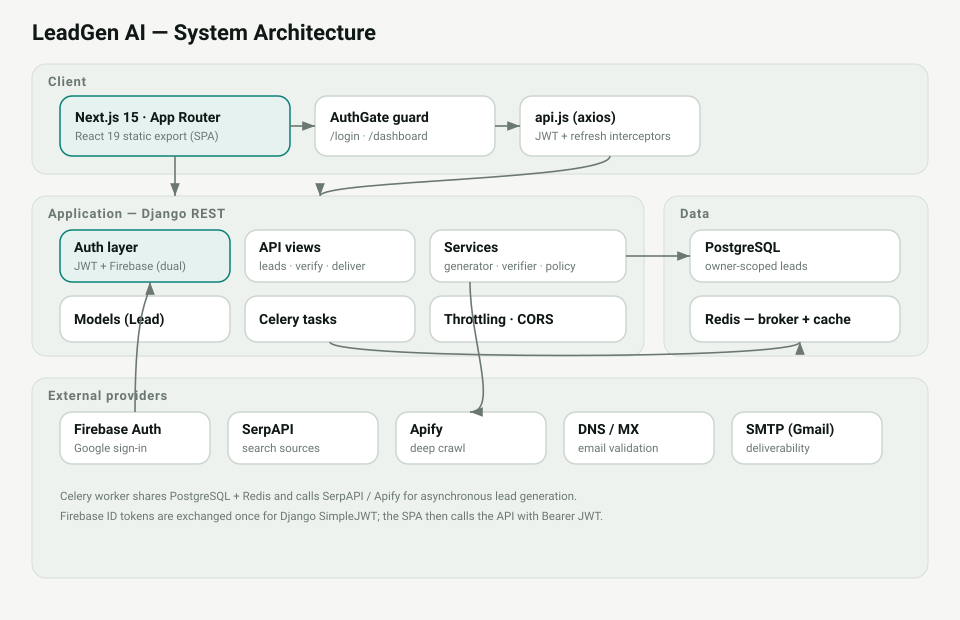
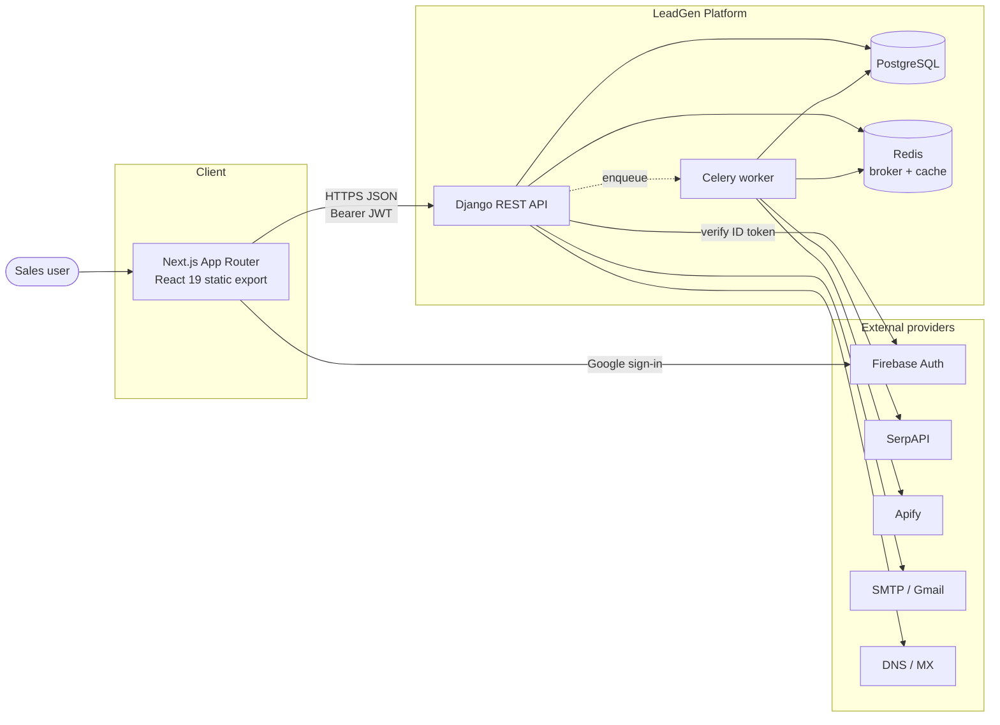
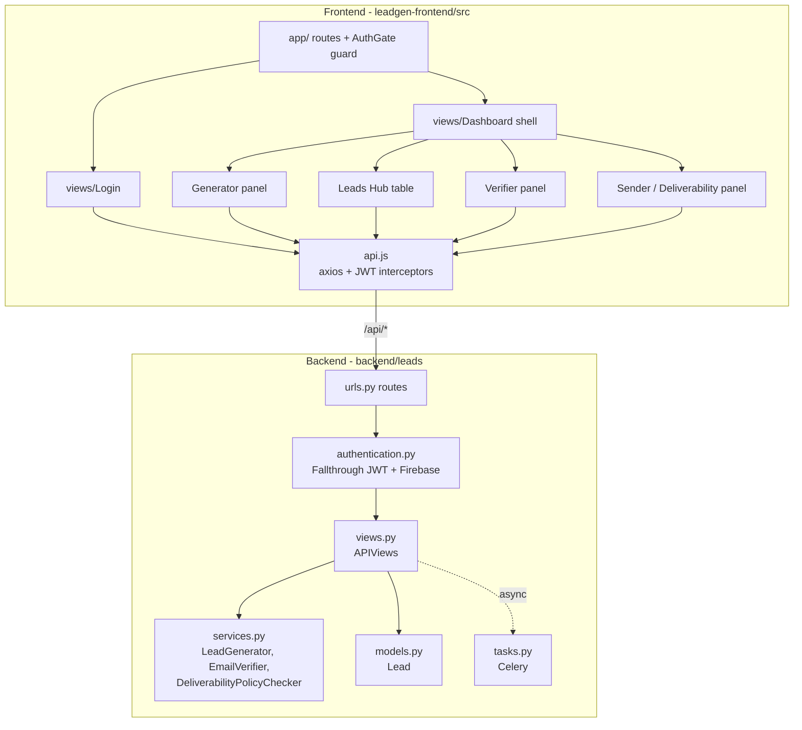
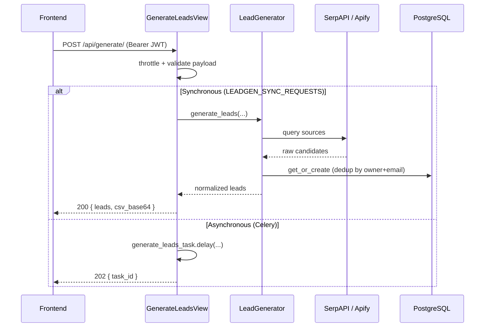
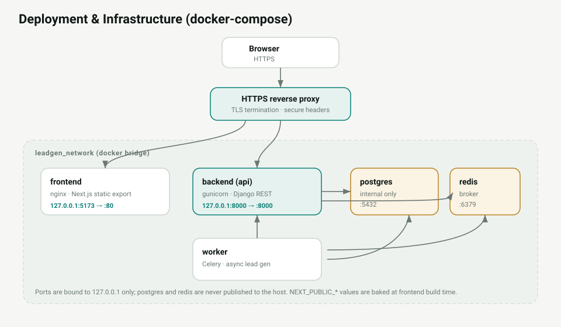
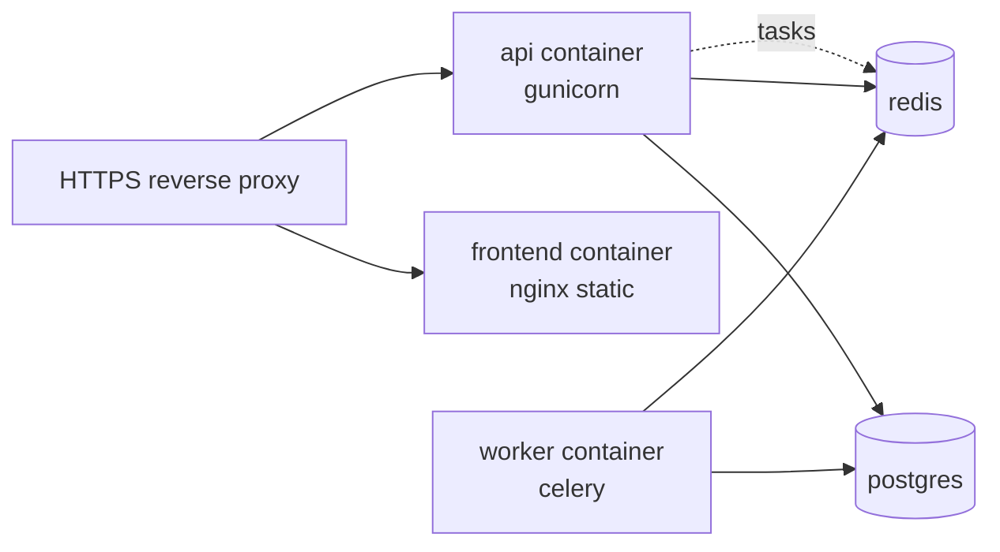

# System Architecture

LeadGen AI is a two-tier web application: a Next.js frontend and a Django REST
API, backed by PostgreSQL, Redis, and a Celery worker, with third-party data and
auth providers. This document is the reviewer-facing overview of how the pieces
fit together.

## 1. Context diagram

## 2. Container / component view

## 3. Request lifecycle (lead generation)

## 4. Technology stack

| Layer | Technology |
| --- | --- |
| Frontend | Next.js 15 (App Router, static export), React 19, Tailwind CSS, Framer Motion, Axios |
| Auth | Firebase Google sign-in + Django SimpleJWT |
| API | Django 5.2, Django REST Framework 3.16 |
| Async | Celery + Redis broker, `django-celery-beat` |
| Data | PostgreSQL (prod), SQLite (tests) |
| Providers | SerpAPI, Apify, DNS/MX, SMTP (Gmail) |
| Quality | pytest + coverage, pylint, Vitest + istanbul, ESLint |
| CI/CD | GitHub Actions (CI + repository hygiene) |
| Runtime | Docker Compose (api, worker, db, redis, frontend) |

## 5. Deployment topology

- `db` and `redis` are **not** published to the host by default.
- The frontend is built to static assets and served by nginx (`nginx.conf`).
- The API runs behind an HTTPS-terminating proxy; secure cookies + HSTS apply.

## 6. Key architectural decisions

- **Owner-scoped data model.** Every `Lead` has an `owner`; all reads/writes
  filter by the authenticated user, preventing cross-tenant access.
- **Dual bearer auth.** A tolerant JWT authenticator defers to Firebase instead
  of failing, so one `Authorization` header supports both schemes during the
  Firebase→JWT transition. See [security.md](security.md).
- **Sync/async toggle.** `LEADGEN_SYNC_REQUESTS` lets long provider calls run in
  Celery in production while staying synchronous in tests/local dev.
- **Streamed CSV export.** Exports stream row-by-row rather than buffering the
  whole file in memory.

See also: [wireframes.md](wireframes.md), [nextjs-migration-plan.md](nextjs-migration-plan.md).
