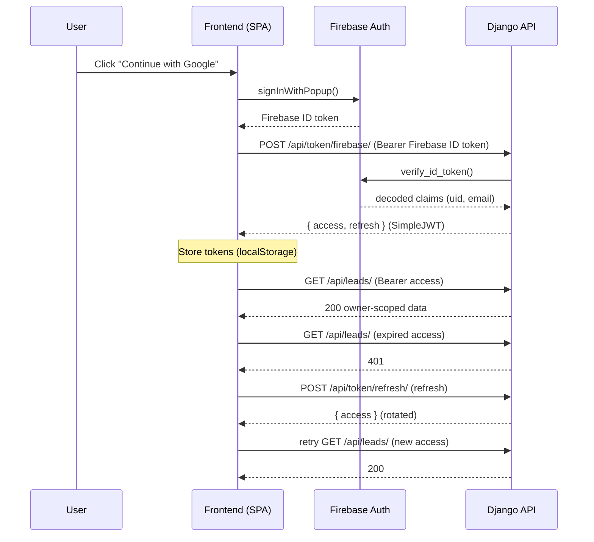

# Security Notes

## Current Security Model

- API access is authenticated by default (`IsAuthenticated`).
- Two token schemes are accepted on the `Authorization: Bearer <token>` header:
  1. **Django SimpleJWT** access tokens (primary) — validated by
     `FallthroughJWTAuthentication`.
  2. **Firebase ID tokens** (login / fallback) — verified by
     `FirebaseAuthentication`.
- Leads are scoped by owner; every queryset filters on `owner=request.user`.
- Health checks return minimal public data (no provider or SMTP identity).
- PostgreSQL and Redis are internal Docker services by default.
- Production settings require a real `SECRET_KEY`.
- Per-IP and per-user throttling is enabled (`100/hour` anon, `1000/hour` user).

## Authentication (JWT) Flow

The frontend signs the user in with Google via Firebase, then immediately
exchanges the Firebase ID token for a Django-issued JWT pair. All subsequent
API calls use the Django access token; a 401 triggers a one-shot refresh.

### Token endpoints

| Endpoint | Purpose |
| --- | --- |
| `POST /api/token/` | Obtain an access/refresh pair from username + password. |
| `POST /api/token/refresh/` | Rotate and return a new access token. |
| `POST /api/token/verify/` | Validate a token. |
| `POST /api/token/blacklist/` | Blacklist a refresh token (logout). |
| `POST /api/token/firebase/` | Exchange a verified Firebase ID token for a JWT pair. |

### JWT hardening

- Access tokens are short-lived (15 min default, `JWT_ACCESS_MINUTES`).
- Refresh tokens rotate on use and old ones are blacklisted
  (`ROTATE_REFRESH_TOKENS`, `BLACKLIST_AFTER_ROTATION`).
- Tokens are signed with the Django `SECRET_KEY` (HS256); rotating the secret
  invalidates every issued token.

## Secrets

Never commit:

- `.env`
- credentials files
- runtime logs
- API keys
- Firebase service account JSON

Use `.env.example` files for documentation only.

## SSRF Controls

Website crawling blocks:

- localhost
- private IPs
- loopback addresses
- link-local addresses
- reserved or unspecified addresses
- unsafe redirects

## Deployment Checklist

- `DEBUG=False`
- real `SECRET_KEY`
- restricted `ALLOWED_HOSTS`
- exact `CORS_ALLOWED_ORIGINS`
- HTTPS in front of Django
- secure cookies enabled
- HSTS enabled after HTTPS is stable
- Redis not exposed publicly
- Postgres not exposed publicly
- Celery worker running for async jobs
