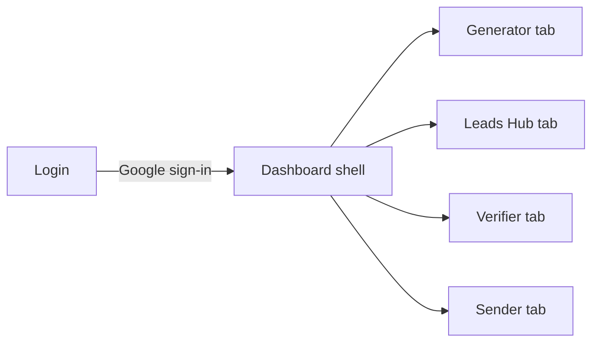

# Wireframes

Low-fidelity wireframes for the primary screens. These describe layout, regions,
and interactions independent of visual styling. They map directly to the
implemented components in `leadgen-frontend/src`.

## Screen map



## 1. Login


```
+--------------------------------------------------------------+
|  LeadGen AI                                                   |
|                                                              |
|   Find Your Next Big Client            +------------------+  |
|   AI-powered B2B lead discovery.       |   Welcome Back   |  |
|                                        |                  |  |
|   [Target]  [Verified]                 | [ Continue with  |  |
|   [Scale ]  [B2B    ]  <- feature grid |    Google      ] |  |
|                                        |                  |  |
|   Multi | MX | 24/7   <- stat row      | Authenticated API|  |
|                                        +------------------+  |
+--------------------------------------------------------------+
```

- Single primary action: **Continue with Google**.
- On success: Firebase sign-in → exchange for Django JWT → route to Dashboard.
- Loading and error states surface via toast.

## 2. Dashboard shell


```
+----------------+---------------------------------------------+
|  SIDEBAR       |  PAGE HEADER (eyebrow / title / subtitle)   |
|                +---------------------------------------------+
|  * Generator   |                                             |
|    Leads Hub   |            ACTIVE TAB CONTENT               |
|    Verifier    |                                             |
|    Sender      |                                             |
|                |                                             |
|  [stats]       |                                             |
|  Theme toggle  |                                             |
|  Sign Out      |                                             |
+----------------+---------------------------------------------+
   (mobile: sidebar collapses behind a top-bar menu button)
```

- Left nav switches tabs; the badge on **Leads Hub** shows the total count.
- Footer holds the light/dark toggle and **Sign Out** (clears JWT + Firebase).

## 3. Generator tab


```
+---------------------------------------------------------------+
|  Lead Extraction Engine                                       |
|  Niche [ select v ]        Target Country [ select v ]       |
|                                                               |
|  Source Platforms:  [Reddit] [X] [Google Maps] [Professional]|
|                                                               |
|  (if Google Maps)  Engine: SerpAPI  <---> Apify   [ toggle ]  |
|                                                               |
|                                   [ Reset ]  [ Run Extraction]|
+---------------------------------------------------------------+
```

- Required: niche + country + at least one platform (Run disabled otherwise).
- Submitting posts to `/api/generate/` and reports results via alert/toast.

## 4. Leads Hub tab


```
+---------------------------------------------------------------+
|  [ Search email/source... ]        [Export CSV] [Bulk Verify] |
+---------------------------------------------------------------+
|  Email        | Phone | Source | Website | Location | Status  |
|  a@x.com      |  -    | Reddit | x.com   | US       | Pending |
|               |       |        |         |     [Verify][Del]  |
|  ...                                                          |
+---------------------------------------------------------------+
|  N leads                                        Updated now   |
+---------------------------------------------------------------+
```

- Search filters client-side by email/category/source.
- Row actions: **Verify** (per lead) and **Delete** (owner-scoped).
- Export streams a CSV of verified leads from `/api/leads/export/`.

## 5. Verifier tab


```
+-------------------------------+-------------------------------+
|  Single Lookup                |  Batch Verify                 |
|  Email [___________] [Verify] |  [ textarea: emails ]         |
|  -> Status / MX / Score card  |  [ Run Batch ]                |
+-------------------------------+-------------------------------+
|  File Upload (CSV/TXT)  [ drop zone ]  [ Bulk Verify All ]    |
+---------------------------------------------------------------+
```

- Single lookup posts `/api/leads/verify-single/`.
- Batch posts `/api/leads/verify-multi/` (comma/newline separated).
- Results render inline with valid/invalid badges.

## 6. Sender / Deliverability tab


```
+-------------------------------+-------------------------------+
|  Sender identity  [Active]    |  Sender Settings              |
|  Deliverability Policy Checker|  Provider / From / Filter     |
|   Subject [______]            +-------------------------------+
|   Daily Volume [__]           |  Inbox Risk                   |
|   DKIM [______]               |   ( score ring )              |
|   Body [__________]           |   check list + Fix Next       |
|   [x] Unsubscribe             |                               |
|   [ Run Policy Check ]        |                               |
+-------------------------------+-------------------------------+
```

- Posts `/api/deliverability/check/`; renders a score, per-check pass/fail, and
  prioritized recommendations. Errors surface as an inline badge.

## Responsive behavior

- **≥1024px:** persistent sidebar, multi-column panels.
- **<1024px:** sidebar collapses to an overlay opened from the top bar; panels
  stack to a single column.
