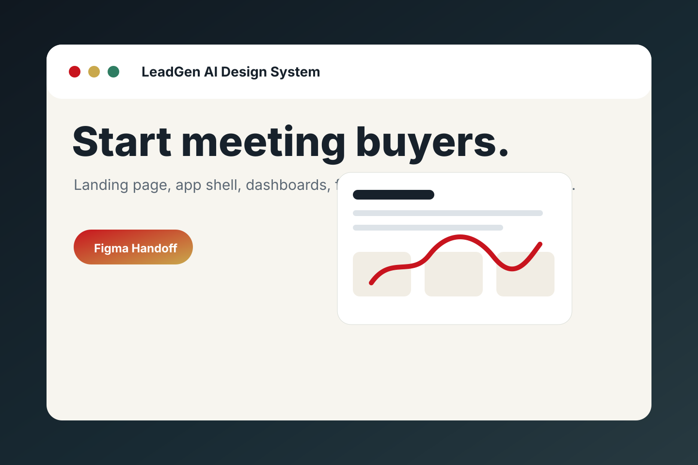
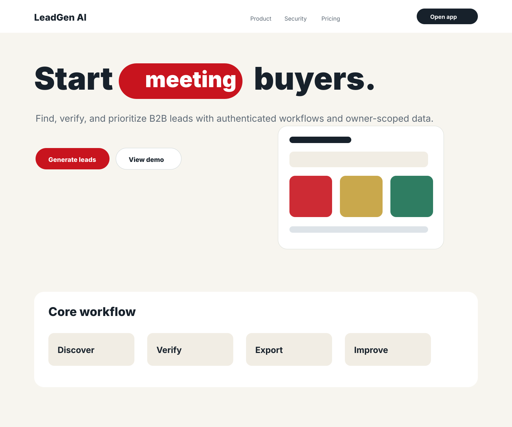
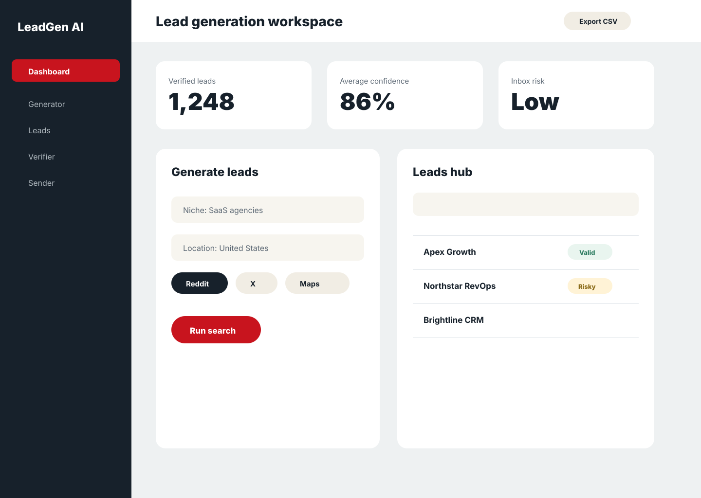
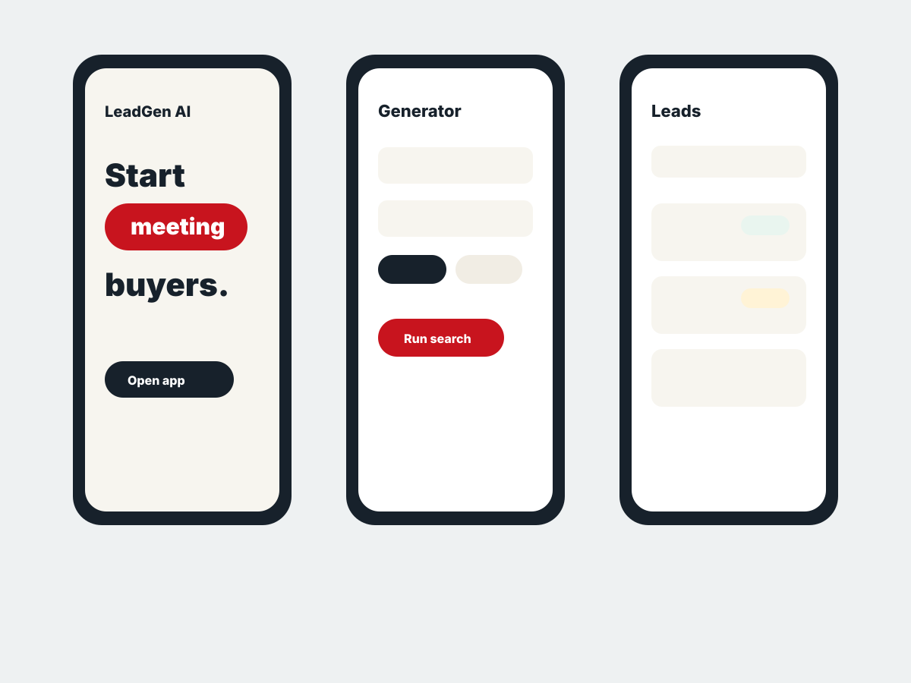
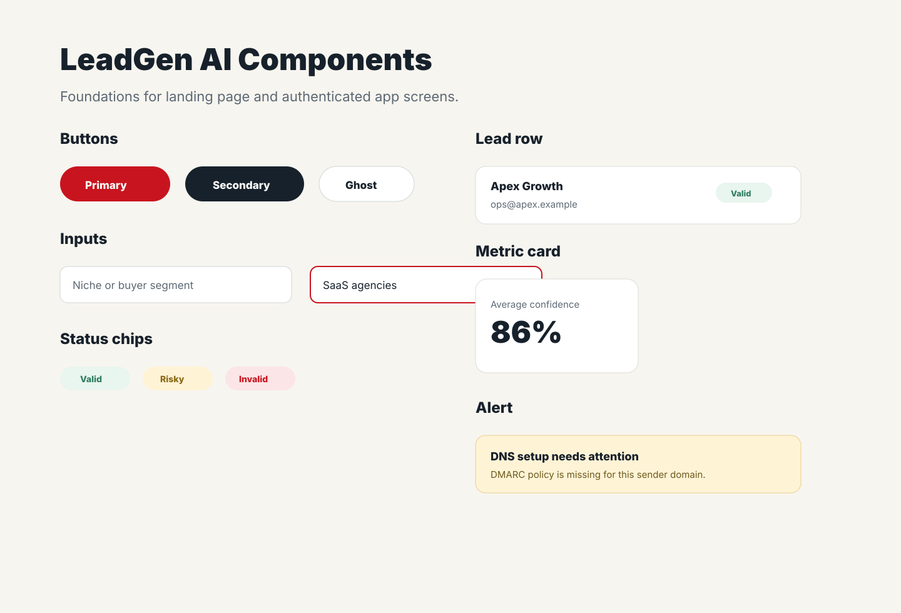

# Figma Design Handoff

This folder now includes both design specs and real visual assets for Figma.
Drag the SVG files from `assets/` into a Figma file, then use the markdown specs
as the page notes and acceptance criteria.

## Visual Assets

| Preview | File | Use |
| --- | --- | --- |
|  | `assets/cover.svg` | Figma cover page |
|  | `assets/landing-page-desktop.svg` | Landing page desktop screen |
|  | `assets/app-dashboard.svg` | Authenticated app dashboard |
|  | `assets/mobile-flow.svg` | Responsive mobile screens |
|  | `assets/component-board.svg` | Buttons, fields, chips, cards, rows |

## Design Specs

- [Design Brief](design-brief.md)
- [Landing Page Spec](landing-page-spec.md)
- [Application Spec](application-spec.md)
- [Design Tokens](design-tokens.md)
- [Components](components.md)
- [Prototype Flow](prototype-flow.md)

## Recommended Figma Pages

1. Cover: use `assets/cover.svg`.
2. Foundations: colors, type, spacing, shadows from `design-tokens.md`.
3. Landing Page: use `assets/landing-page-desktop.svg` and `landing-page-spec.md`.
4. App Shell: use `assets/app-dashboard.svg` and `application-spec.md`.
5. Mobile: use `assets/mobile-flow.svg`.
6. Components: use `assets/component-board.svg` and `components.md`.
7. Prototype: connect the flows from `prototype-flow.md`.

## Design Acceptance

- The landing hero keeps the `meeting -> booking -> closing -> winning -> signing` animated word pill concept.
- The app screens show real product workflows, not marketing-only placeholders.
- States are represented for valid, risky, invalid, loading, and empty data.
- Components are reusable enough to build the rest of the project screens.
